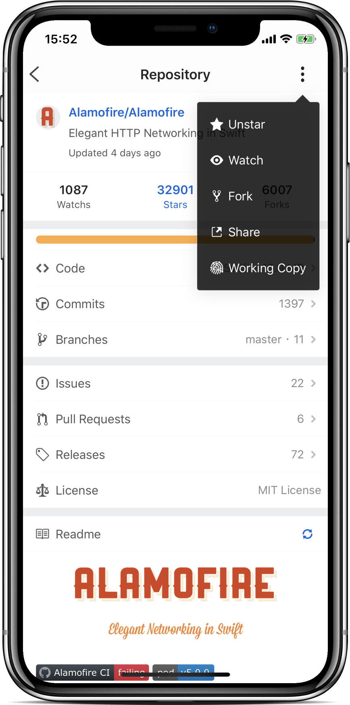
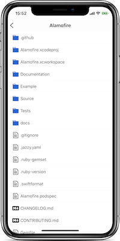
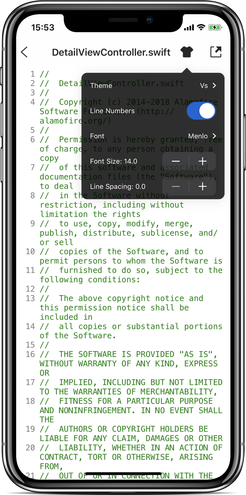
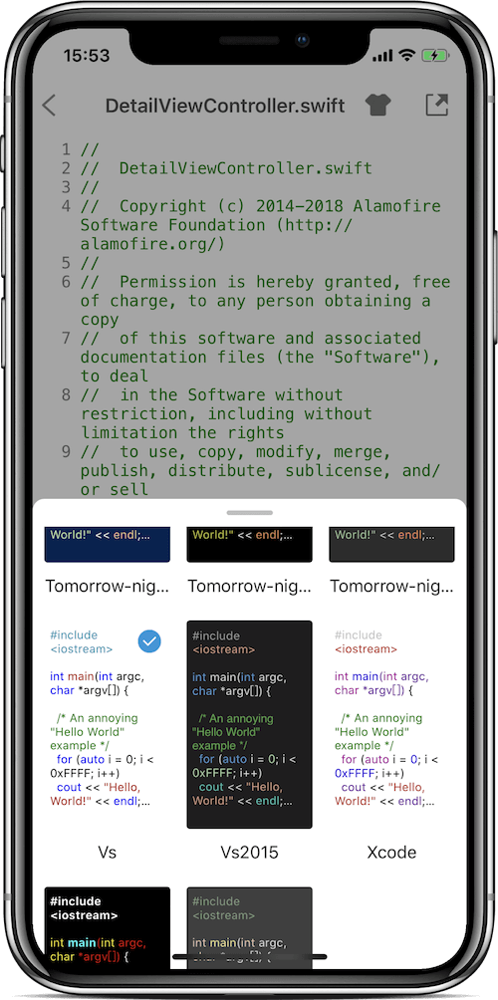
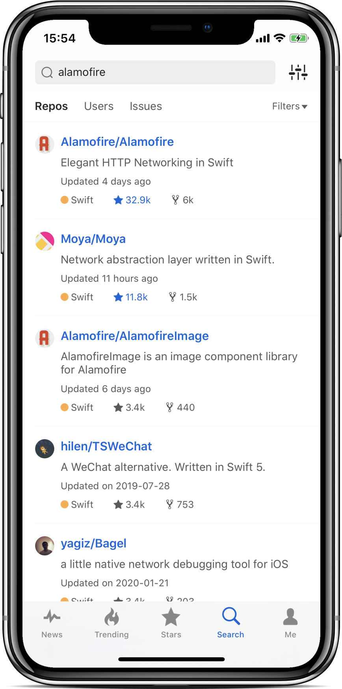
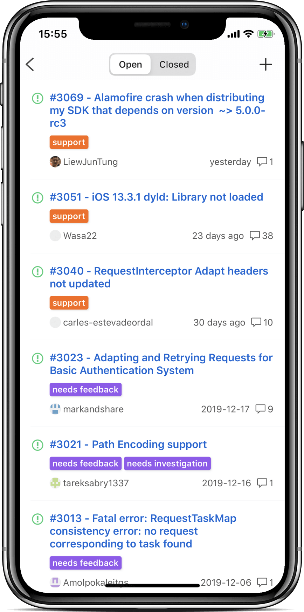
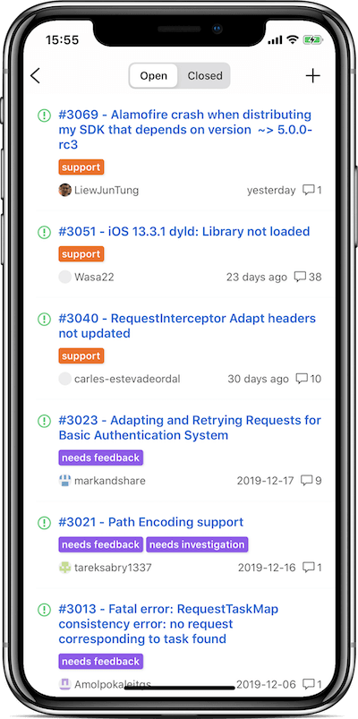

# GeekHub for GitHub
This repo is used for collecting feedback from GeekHub users - 此仓库用来收集GeekHub用户反馈

  

# Screenshots

# Contact
- Email: evanzhou1989@gmail.com
- QQ Group: [744010852](mqqapi://card/show_pslcard?src_type=internal&version=1&uin=744010852&key=ec04d730cab686b4f8f898ae3a09b10f2f551070828173d3a799632eb7f0a048&card_type=group&source=external) 
- Telegram: https://t.me/GeekHub
